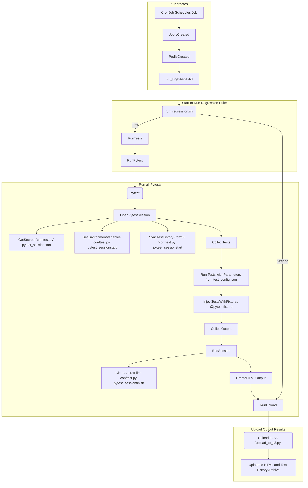

# regression-tests
Regression Test Suite

This regression test suite uses Pytest and to run a test suite and builds an output webpage.

By collecting history runs it generates graphs and diagrams of the previous runs

#### TODOs

1. Add tests for additional services
2. Export test config to an external place and allow for importing this config at runtime
3. Allow data Tests to be more configurable based on Object/Attribute validations
4. Better/proper logging

# Build and Run
#### Run Locally

Prerequisites
> Install Python  
> Install Pip  
> Install python dependencies with 'pip install -r ./requirements.txt'

Run 'run_regression.sh' with access to AWS Resources by exporting your keys to a local $HOME/.aws/credentials file
> ./run_regression.sh

#### View Results
Open the local './output/results.html'

Alternatively the output will be pushed to an S3 Bucket whose name you can find the in the environment file

#### Trigger Manually in AWS
While in AWS you can manually trigger the cronjob

> kubectl create job -n namespace  --from=cronjob/regression-tests regression-manual-0001

#### Build Image Locally
> docker build --no-cache --build-arg JFROG_USER="<USER>" --build-arg JFROG_PASSWORD="<Access-Token>" -t organization.jfrog.io/docker-dev/regression-tests:0.0.1 .

## Project Flow

# Project Help
#### Important Files

1. run_regression.sh
> 'run_regression.sh' is a small wrapper script so that the docker image can execute by running multiple python commands

2. environment.json
> 'environment.json' and 'environment-<env>.json' contains environment urls and non-secret environment data

3. test/test_config.json
> 'test/test_config.json' contains input test data. Parameterized tests are derived from this

4. test/test_secrets.json
> 'token.txt' and 'test/test_secrets.json'. Pulled secret data which is destroyed after use

#### How We Use Pytest
Pytest is a python testing framework which allows us to create parameterized unit and regression tests. By leveraging the ease of python, we can create simple tests to validate our API are responding correctly.

Pytest allows us to

1. Use fixture injection to reuse code that is shared across tests. For instance we can get Auth token and reuse it intelligently.
2. Pytest allows for parameterized testing. This allows us to change the inputs sets to be as large or as small as we need. We can store the test inputs seperately from the tests and modify each independantly.
3. Pytest has exposed API hooks we can use to call preperatory code before running or after running tests. This allows us to sync with AWS S3 and Secrets Manager in advance of running our tests, so no secrets need to be commited to a repository.

#### How We Use Kubernetes and Docker

Kubernetes allows us to

1. Run Docker images
2. Create a CronJob to run the image on a fixed schedule such as every 4 or 6 hours, or even more complicated schedules like every other sunday at 4 pm
3. The CronJob creates a Job on the interval and the Job creates the Pod which executes the Docker image until completed and then closes it, saving the last few runs
4. Allows us to manually run the job deriving the details from the existing cronjob
5. Use Helm templates to modify our codes values

Docker allows us to

1. Precreates and load all needed code into one place and wraps multiple python scripts into a single entrypoint
2. Build in only our needed python dependencies to minimize software vulnerabilities
3. Isolates only the minimum required files to run all of our regression
4. Integrate with Kubernetes CronJobs

#### Why Is It Built 'This' Way?

The following overall functionality is desired:

Security and Environment Agnostism

1. Test code is secure and no secrets are present
2. Test code can be run from inside the EKS Cluster
3. Backup of results are placed into S3

Ease

1. Tests can be scheduled to run automatically with no human input, alternatively we can force it to run easily from inside the environment
2. Test code can be dockerized once and ran on all environments with the same image version
3. Excess libraries are minimized

Results

1. Test results are easy to read reguardless of background
2. The results can be compared to prior results by saving previous runs

Tests are Modular

1. Tests are parametizable and we can place these input paremeters outside of code
2. Tests segments are reusable to minimize duplicate code